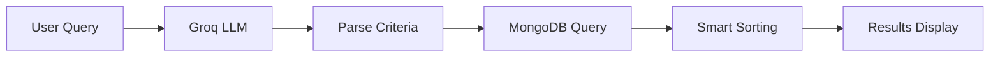
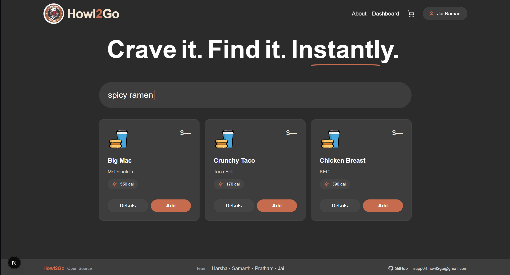
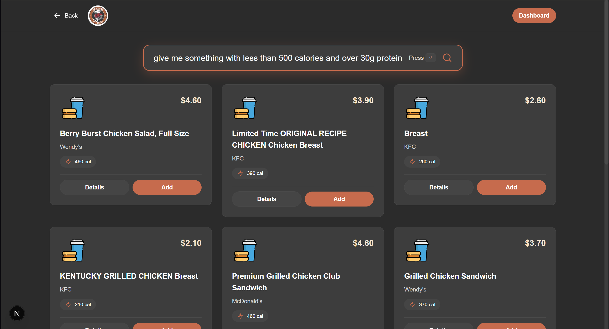

# Howl2Go

<div align="center">


**AI-Powered Food Discovery Platform**

*Crave it. Find it. Instantly.*


[](https://drive.google.com/file/d/1GpH5jJUv2xHC_xYNScsTxllGcykTA2Hj/view?usp=drive_link)


<!-- Build & Quality Badges -->
[](https://howl2go-backend-service.onrender.com/api/health)
[](https://doi.org/10.5281/zenodo.17547804)
[](https://coveralls.io/github/harsha711/SE_Project_Grp_27?branch=main)
[](https://github.com/harsha711/SE_Project_Grp_27)
[](https://github.com/harsha711/SE_Project_Grp_27)
[](LICENSE)

<!-- Technology Badges -->
[](https://nextjs.org/)
[](https://reactjs.org/)
[](https://www.typescriptlang.org/)
[](https://nodejs.org/)
[](https://expressjs.com/)
[](https://www.mongodb.com/)

<!-- Frontend Stack -->
[](https://tailwindcss.com/)
[](https://www.framer.com/motion/)
[](https://jestjs.io/)
[](https://testing-library.com/)

<!-- Code Quality & Tools -->
[](https://eslint.org/)
[](https://prettier.io/)
[](https://typicode.github.io/husky/)
[](https://standardjs.com/)

<!-- Project Stats -->
[](https://github.com/harsha711/SE_Project_Grp_27)
[](https://github.com/harsha711/SE_Project_Grp_27/fork)
[](https://github.com/harsha711/SE_Project_Grp_27/issues)
[](https://github.com/harsha711/SE_Project_Grp_27/pulls)

[Documentation](Proj_2/docs/) • [Getting Started](Proj_2/docs/GETTING_STARTED.md) • [API Docs](Proj_2/docs/API_DOCUMENTATION.md) • [Features](Proj_2/docs/FEATURES.md)

</div>

---

## What is Howl2Go?

Howl2Go revolutionizes food ordering by **eliminating traditional menus**. Instead of scrolling through endless options, simply describe what you want in plain English:

> *"Meal under 500 calories"*
>
> *"Give me something with low carbs"*
>
> *"Find me low fat burger"*

Our AI instantly understands your requirements and shows you exactly what you're looking for.

## ✨ Key Features

<table>
<tr>
<td width="50%">

### 🧠 **Natural Language Search**
Search using conversational queries instead of complex filters. Powered by Llama 3.1 via Groq.

### 📊 **Smart Nutritional Filtering**
Filter by calories, protein, carbs, fat, fiber, sugar, transfat, and 10+ nutritional parameters.

### 🏪 **Multi-Restaurant Discovery**
Browse 1,148+ items from McDonald's, Burger King, Wendy's, KFC, Taco Bell.

</td>
<td width="50%">

### ⚡ **Lightning Fast**
Get results in under 2 seconds with optimized MongoDB queries and AI processing.

### 🎨 **Beautiful UI**
Modern dark theme with smooth animations and responsive design that works on all devices.

### 🔒 **Developer-Friendly**
Complete REST API, TypeScript support, comprehensive docs, and pre-commit and post-commit hooks.

</td>
</tr>
</table>

## 🚀 Quick Start

### Prerequisites
- Node.js 18+ and npm 9+
- MongoDB Atlas account (or local MongoDB)
- Groq API key ([Get free key](https://console.groq.com))

### 1. Clone the Repository
```bash
git clone https://github.com/harsha711/SE_Project_Grp_27.git
cd SE_Project_Grp_27/Proj\ 2
```

### 2. Setup Backend
```bash
cd Howl2Go_backend
npm install

# Create .env file
echo "GROQ_API_KEY=your_groq_api_key" > .env
echo "MONGODB_URI=your_mongodb_connection_string" >> .env

# Import nutrition data
npm run import:fastfood

# Start server
npm run dev
```

### 3. Setup Frontend
```bash
cd ../Howl2Go_frontend
npm install
npm run dev
```

### 4. Open Application
Navigate to **http://localhost:3000** and start searching!

📖 **[Full Setup Guide →](Proj_2/docs/DEVELOPER_SETUP.md)**

## 🎯 How It Works



1. **User enters query** in natural language
2. **AI processes** and extracts nutritional criteria
3. **MongoDB searches** 1,148+ food items
4. **Smart sorting** ranks results by relevance
5. **Beautiful UI** displays matches instantly

## 📸 Screenshots

| Home Page | Search Results |
|-----------|----------------|
|  |  |

## 🛠️ Tech Stack

**Frontend**
- Next.js 15 with App Router
- React 19 with TypeScript
- Tailwind CSS 4
- Framer Motion for animations
- Lucide React icons

**Backend**
- Node.js 18+ with Express.js 5
- MongoDB Atlas with Mongoose
- Groq SDK (Llama 3.1 8B Instant)
- CORS, Morgan, dotenv

**DevOps**
- Husky for Git hooks
- ESLint for code quality
- Jest for testing
- Nodemon for hot reload

## 📚 Documentation

| Document | Description |
|----------|-------------|
| [Getting Started](Proj_2/docs/GETTING_STARTED.md) | Complete user guide with search examples |
| [Developer Setup](Proj_2/docs/DEVELOPER_SETUP.md) | Development environment setup |
| [API Documentation](Proj_2/docs/API_DOCUMENTATION.md) | REST API reference |
| [Features](Proj_2/docs/FEATURES.md) | Complete feature catalog |

## 🧪 Testing

```bash
# Backend tests
cd Howl2Go_backend
npm test

# Frontend tests
cd Howl2Go_frontend
npm test
```

**Test Coverage:**
- 200+ comprehensive test cases for Frontend and Backend Functionalities respectively
- Unit tests for API endpoints
- Integration tests for LLM service
- Frontend component tests

## 🗂️ Project Structure

```
SE_Project_Grp_27/
├── Proj_2/
│   ├── Howl2Go_backend/      # Express.js API server
│   ├── Howl2Go_frontend/     # Next.js React app
│   ├── Howl2Go_LLM/          # LLM testing scripts
│   ├── docs/                 # Project documentation
|
├── Proj_1/                   # Project planning docs
└── README.md                 # This file
```

## 🌟 Feature Highlights

### Current Milestones
- ✅ Natural language food search
- ✅ Multi-restaurant discovery (1,148+ items)
- ✅ Nutritional filtering (10+ parameters)
- ✅ Smart recommendations
- ✅ Shopping cart with place order
- ✅ Beautiful dark theme UI
- ✅ Responsive design
- ✅ User authentication

### Future Milestones
- Ingredient-Based Recommendations
- Order History Insights
- Price-Based Recommendations
- Fine-Tuned LLM Integration
- Group Orders Optimization
- Smart Reordering Suggestions

**[Full Roadmap →](Proj_2/docs/FEATURES.md)**

## 👥 Team

**SE_Project_Grp_27**
- Lead Developers:  
[Harsha](https://github.com/harsha711)  <br>
[Pratham](https://github.com/pratham2879)  <br>
[Samarth](https://github.com/Samarth061)  <br>
[Jai](https://github.com/JaiRumz)  <br>

- Course: Software Engineering  
- Institution: NC State University (Fall 2025)

## 📄 License

This project is licensed under the MIT License - see the [LICENSE](LICENSE) file for details.

## 🤝 Contributing

We welcome contributions! Please see our [Contributing Guide](CONTRIBUTING.md) for details.

1. Fork the repository
2. Create your feature branch (`git checkout -b feature/AmazingFeature`)
3. Commit your changes (`git commit -m 'Add some AmazingFeature'`)
4. Push to the branch (`git push origin feature/AmazingFeature`)
5. Open a Pull Request

## 🙏 Acknowledgments

- **Groq** for LLM API access
- **MongoDB Atlas** for database hosting
- **Next.js Team** for the amazing framework
- **Open Source Community** for inspiration and tools

## 📞 Support

- 📧 Email: supp0rt.howl2go@gmail.com
- 🐛 Issues: [GitHub Issues](https://github.com/harsha711/SE_Project_Grp_27/issues)
- 💬 Discussions: [GitHub Discussions](https://github.com/harsha711/SE_Project_Grp_27/discussions)

---

<div align="center">

**Made with ❤️ by SE_Project_Grp_27**

*Crave it. Find it. Instantly.*

</div>
